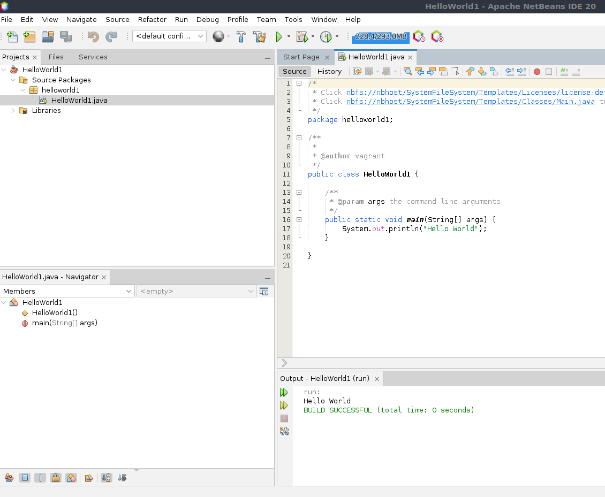

# UD2 - Instalación de un IDE

## Consideraciones

Debido a que el proyecto propuesto a realizar será desarrollado en Java se ha decidido utilizar el IDE Netbeans. La razón de este IDE es debido a las limitaciones que poseemos. Tanto el precio como la imposibilidad de utilizar ciertos programas han dado a que la IDE óptima a utilizar sea netbeans.

Netbeans es gratuito y tenemos certeza de que puede ser utilizado por el equipo de desarrollo.

## Instalación

Para instalar netbeans hemos descargado un zip desde la página web de apache netbeans.

Hemos descomprimido el archivo descargado de netbeans con el siguiente comando en el directorio que queremos:

```bash
unzip netbeans-20-bin.zip
```

Una vez hecho esto nos dirigimos a la carpeta de ejecución de netbeans con `cd`.

```bash
<directorio de instalación>/netbeans/bin/
```

Una vez allí podemos ejecutar el siguiente comando para abrir netbeans:

```bash
sh netbeans 
```

## Funcionalidad

